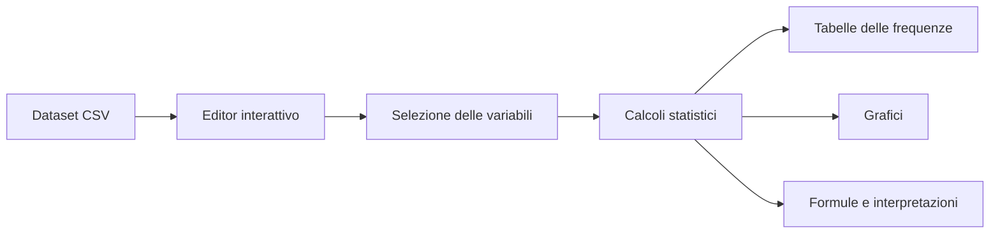

# 📊 StatLab — Dashboard di analisi statistica interattiva

**StatLab** è una dashboard sviluppata con **Python e Streamlit** per eseguire un’analisi statistica descrittiva interattiva sul dataset `winequality-white.csv`.

L’applicazione permette di selezionare le variabili da studiare, modificare direttamente i dati e visualizzare automaticamente tabelle, indicatori statistici e grafici.

---

## 🎯 Obiettivo del progetto

Il progetto ha lo scopo di applicare i principali strumenti della **statistica descrittiva** a un dataset reale.

La dashboard consente di:

- analizzare singolarmente una variabile numerica;
- confrontare due variabili;
- costruire tabelle delle frequenze;
- studiare posizione, variabilità e forma della distribuzione;
- rappresentare graficamente i dati;
- interpretare i risultati attraverso spiegazioni integrate nell’interfaccia.

---

## ✨ Funzionalità principali

### Dataset interattivo

Il dataset viene mostrato attraverso un editor che permette di:

- visualizzare tutti i dati;
- modificare i valori;
- aggiungere nuove righe;
- eliminare righe;
- aggiornare immediatamente calcoli e grafici.

### Configurazione dalla sidebar

Dalla barra laterale è possibile scegliere:

- la variabile da analizzare;
- la variabile da utilizzare sull’asse X;
- la variabile da utilizzare sull’asse Y;
- il numero di classi degli istogrammi e delle tabelle di frequenza.

### Indicatori riepilogativi

La parte iniziale della dashboard mostra quattro card con:

- media;
- mediana;
- deviazione standard;
- coefficiente di correlazione.

---

## 🧮 Analisi statistiche disponibili

### Tabelle delle frequenze

Per la variabile selezionata vengono calcolate:

- frequenza assoluta;
- frequenza relativa;
- frequenza assoluta cumulativa;
- frequenza relativa cumulativa.

I dati vengono raggruppati in intervalli, il cui numero può essere scelto dalla sidebar.

### Indici di posizione

- **Media campionaria**: valore medio delle osservazioni.
- **Mediana campionaria**: valore centrale dei dati ordinati.
- **Moda campionaria**: valore o valori che compaiono più frequentemente.

### Indici di variabilità

- **Varianza campionaria**;
- **deviazione standard campionaria**;
- **scarto medio assoluto**;
- **ampiezza del campo di variazione**;
- **coefficiente di variazione**.

### Indici di forma

- **Skewness**, per misurare l’asimmetria della distribuzione;
- **curtosi**, per analizzare la forma e il peso delle code.

### Quartili

- primo quartile `Q1`;
- terzo quartile `Q3`;
- scarto interquartile `IQR`.

### Analisi bivariata

- diagramma a dispersione;
- coefficiente di correlazione campionario;
- interpretazione dell’intensità e della direzione della relazione.

---

## 📈 Grafici disponibili

La dashboard genera:

- istogramma delle frequenze assolute;
- istogramma delle frequenze relative;
- grafico delle frequenze assolute cumulative;
- grafico delle frequenze relative cumulative;
- box plot;
- grafico a ciambella della distribuzione per classi;
- diagramma a dispersione tra due variabili.

---

## 🗂️ Organizzazione della dashboard

L’interfaccia è divisa in quattro sezioni principali:

| Sezione | Contenuto |
|---|---|
| **Tabelle** | Tabella delle frequenze e riepilogo degli indici |
| **Distribuzione** | Istogrammi, box plot e grafico a ciambella |
| **Relazioni** | Diagramma a dispersione tra due variabili |
| **Formule e indici** | Posizione, variabilità, forma, quartili e correlazione |

---

## 🍷 Dataset

Il progetto utilizza il file:

```text
winequality-white.csv
```

Il dataset contiene **4.898 osservazioni** e **12 variabili numeriche** relative alle caratteristiche chimico-fisiche e alla qualità del vino bianco:

- `fixed acidity`;
- `volatile acidity`;
- `citric acid`;
- `residual sugar`;
- `chlorides`;
- `free sulfur dioxide`;
- `total sulfur dioxide`;
- `density`;
- `pH`;
- `sulphates`;
- `alcohol`;
- `quality`.

Il file utilizza il punto e virgola come separatore. L’applicazione riconosce automaticamente il formato tramite:

```python
pd.read_csv(
    "winequality-white.csv",
    sep=None,
    engine="python",
)
```

---

## 🛠️ Tecnologie utilizzate

- **Python**
- **Streamlit**
- **Pandas**
- **NumPy**
- **Matplotlib**
- **Seaborn**

---

## 📁 Struttura del progetto

```text
StatLab/
├── app.py
├── funzioni_dashboard.py
├── winequality-white.csv
├── README.md
└── .streamlit/
    └── config.toml
```

### `app.py`

Contiene:

- configurazione della pagina Streamlit;
- caricamento del dataset;
- struttura generale della dashboard;
- editor dei dati;
- organizzazione delle sezioni e dei tab.

### `funzioni_dashboard.py`

Contiene:

- stile CSS della dashboard;
- configurazione della sidebar;
- funzioni per i calcoli statistici;
- interpretazione degli indici;
- creazione delle tabelle;
- generazione dei grafici;
- visualizzazione delle formule e delle descrizioni.

### `.streamlit/config.toml`

Contiene la configurazione del tema grafico dell’applicazione.

---

## ⚙️ Installazione

È consigliato utilizzare un ambiente virtuale Python.

### Linux e macOS

Clona la repository ed entra nella cartella del progetto:

```bash
git clone <URL-DELLA-REPOSITORY>
cd <NOME-DELLA-CARTELLA>
```

Crea l’ambiente virtuale:

```bash
python3 -m venv .venv
```

Attivalo:

```bash
source .venv/bin/activate
```

Installa le dipendenze:

```bash
python -m pip install --upgrade pip
python -m pip install streamlit pandas numpy matplotlib seaborn
```

### Windows

```powershell
python -m venv .venv
.venv\Scripts\activate
python -m pip install --upgrade pip
python -m pip install streamlit pandas numpy matplotlib seaborn
```

---

## ▶️ Avvio dell’applicazione

Assicurati che `winequality-white.csv` si trovi nella stessa cartella di `app.py`.

Avvia Streamlit con:

```bash
python -m streamlit run app.py
```

L’applicazione sarà normalmente disponibile all’indirizzo:

```text
http://localhost:8501
```

Per interrompere il server utilizza:

```text
Ctrl + C
```

---

## 🧭 Come utilizzare la dashboard

1. Apri l’editor del dataset per visualizzare o modificare i dati.
2. Seleziona dalla sidebar la variabile da analizzare.
3. Scegli il numero di classi.
4. Seleziona le variabili X e Y per l’analisi bivariata.
5. Consulta le sezioni **Tabelle**, **Distribuzione**, **Relazioni** e **Formule e indici**.
6. Leggi i riquadri descrittivi per interpretare correttamente ogni risultato.

---

## 🔄 Flusso dell’applicazione



---

## 📌 Note

- L’applicazione analizza esclusivamente colonne numeriche.
- Le modifiche effettuate nell’editor influenzano immediatamente tutti i risultati.
- Il coefficiente di correlazione misura una relazione lineare, ma non dimostra un rapporto di causa-effetto.
- Il numero di classi scelto influenza la rappresentazione della distribuzione.
- In presenza di valori mancanti, i calcoli vengono effettuati sulle osservazioni numeriche valide.

---

## 🚀 Possibili sviluppi futuri

- caricamento di dataset CSV direttamente dall’interfaccia;
- esportazione dei risultati;
- confronto simultaneo tra più variabili;
- matrice di correlazione;
- filtri aggiuntivi sui dati;
- generazione automatica di un report.

---

<p align="center">
  Dashboard realizzata con Python, Streamlit, Pandas, Matplotlib e Seaborn.
</p>
